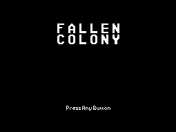
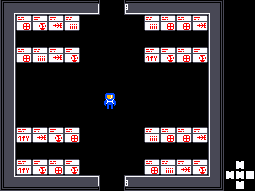
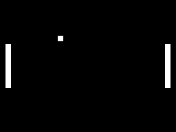
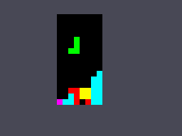
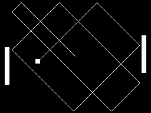

# Vapor Spec
A virtual game platform with capabilities similar to 80s game consoles. 
This repo is contains the Windows/Linux implementation, some games, the compiler, assembler, and documentation.

A Nintendo Switch Homebrew implementation exists [HERE](https://github.com/minkcv/vm-switch).

#### The platform has:
- A 16 bit instruction size
- 16 different general purpose registers
- 65536 bytes (64K) of addressable memory
- An 8-bit color depth screen for a palette of 256 colors
- Support for 256 concurrent sprites
- Support for sprites with 4 colors or 3 colors + alpha
- A screen resolution of 256 x 192 and a refresh rate of 60 Hz (16 ms)
- A maximum of 65536 instructions per program
- A speed of 500,000 instructions per second (0.5 MIPS)

#### An Added Bonus:
- An assembler
- A compiler and language
    - with vim syntax highlighting file in `/etc`
    - and a vscode extension, search the marketplace for `vaporlang`
- Debugging functionality
- Documentation (see [/docs](https://github.com/minkcv/vm/tree/master/docs))

### Included Programs:
Example programs in assembly and vaporlang are included. 

#### Fallen Colony 
This demo includes many sprites, multiple rooms, and a mini map. It does not have combat or win/loss states.

#### Other Programs
These programs are much simpler and some do not use any rom.

One program demonstrates the ability to create sprites at runtime.

### Why did you make this? Who is it for?
This is a hobby project to allow myself and others to write games for a very simple architecture without some of the annoyances that physical architectures impose.

This project can be viewed as a challenge to people like  [demoscene](https://en.wikipedia.org/wiki/Demoscene) members. Please let me know if you make a program.

### How do I build and run it?
#### Linux:
Install SDL2 and libpng if you don't already have them. Systems with apt should try:

    sudo apt install libsdl2-dev libpng-dev

To build and test the platform on linux, run one of the included programs:

    cd vm/games
    ./mars.sh
    ./pong.sh
    ./tetris.sh
    ./fallen.sh

#### Windows (x86):
See the [Releases Section](https://github.com/minkcv/vm/releases) for a pre-built exe and pre-assembled games.
I haven't built the assembler, sprite converter, or compiler for windows.
If you want to build for Windows then you will need the SDL2 dev files and the Platform Toolset v120 (from Visual Studio 2013).

### How do I make a program/game?
1. Have some low level programming knowledge.
2. Check out the [/docs](https://github.com/minkcv/vm/tree/master/docs) folder.
3. Feel free to open an issue on github or ask me for help.
